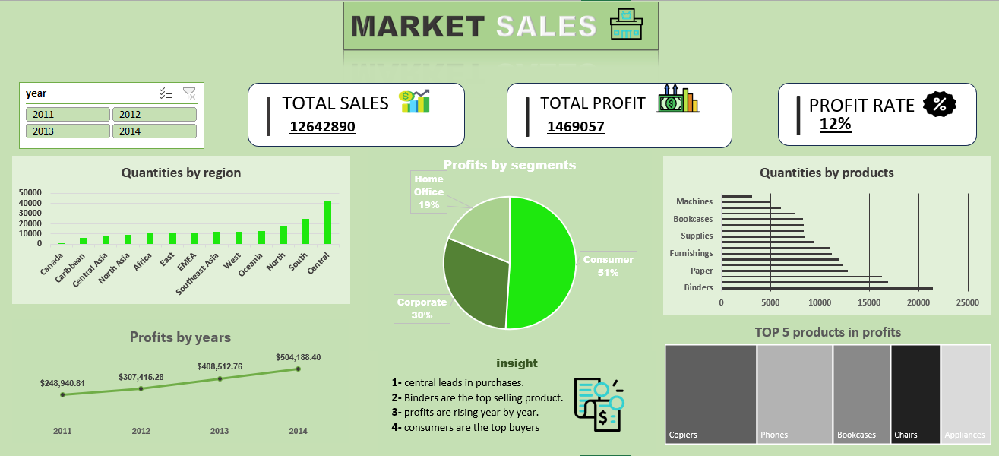
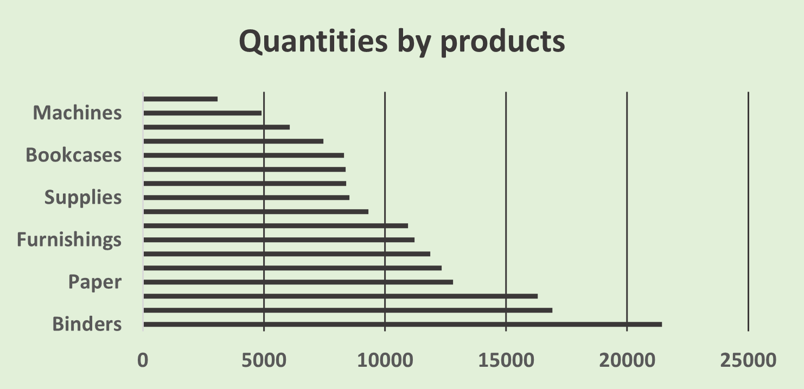
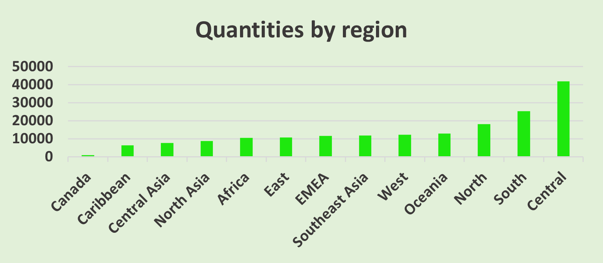
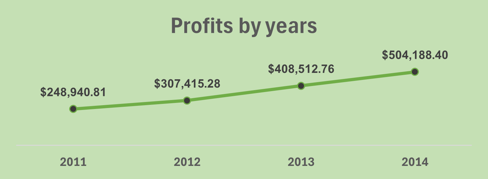
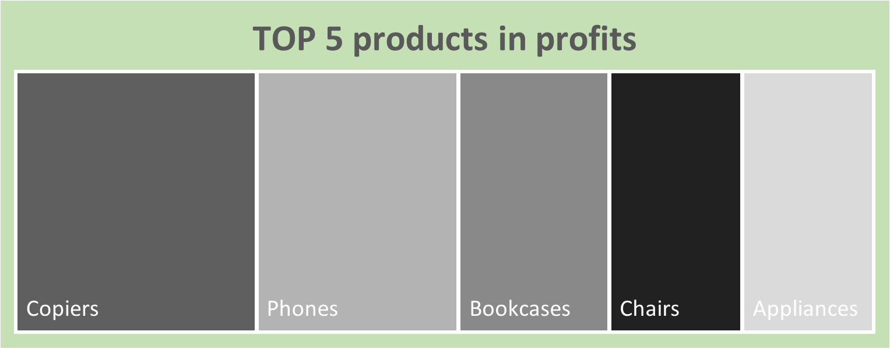
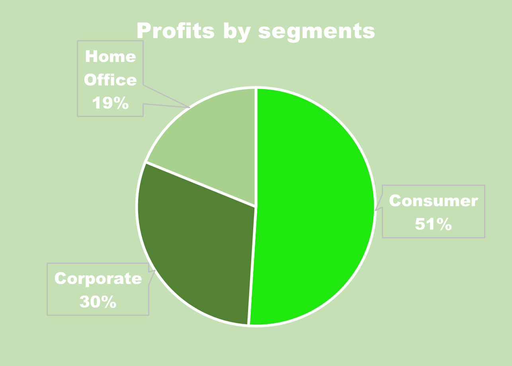

# market_sales_data_analysis_
data analysis project using excel to explore market sales 
## Data source :
from kaggel 
## Tools used :
Excel using Power_Query
## Project Question : 
What factors affect sales and profit performance across region , product categories and customer segment ??
## Explore data :
the data contains 51291 rows and 21 columns 
## Clean data :
1-unimportant columns were removed from the analysis 

2-removed errors 

3-removed duplicate data 

4-each column was converted to a number , data or text format depending on the column and its contents

5-prepared the dataset for analysis 
## data analysis :

                                                         Dashboard
                      

consumers have higher profits than other segments

highest quantities sold in central , south and north ; very low in canada , caribbean and central asia

profits increase over the years

top five products generate the most profits

consumers have higher profits than other segments
## key insights :
-focus on maintaining sufficient stock office products

-are low sales of other products normal??

-profits increase annually ; can make them even higher??

-prioritize and market high profit products : copiers , phones , bookcases , chairs and appliances

-understand and supply what consumers want , as they generate the highest profits

-are low profits frome other customers segments due to product type or other factors??
